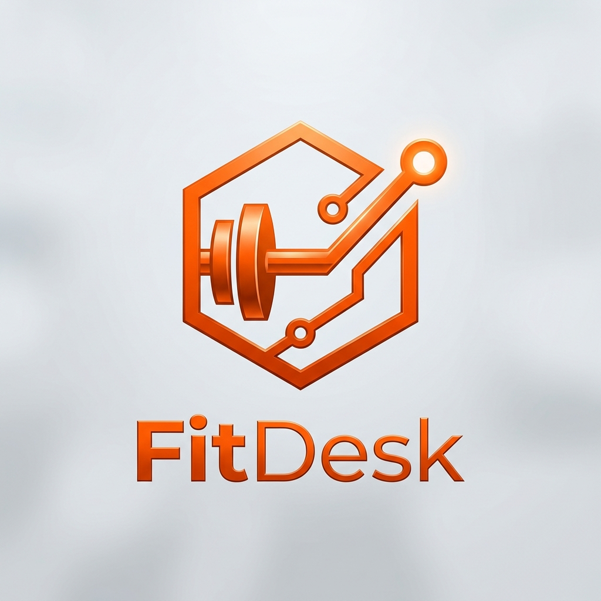

# FITDESK — Inteligência para o seu negócio de Personal Trainer

O **FitDesk** é uma plataforma SaaS (Software as a Service) de alta performance desenhada especificamente para personal trainers que desejam profissionalizar sua gestão, eliminar o papel e escalar seu atendimento através de tecnologia e Inteligência Artificial.

 <!-- Você pode substituir por um screenshot real depois -->

## 🚀 Funcionalidades Principais

- **📅 Agenda Inteligente**: Gestão completa de horários com visão semanal/mensal e sincronização em tempo real.
- **💪 Fichas de Treino Digitais**: Prescrição de treinos com biblioteca de exercícios e acompanhamento de carga pelo aluno.
- **💰 Controle Financeiro**: Gestão de mensalidades, faturas e relatórios de lucratividade.
- **🤖 WhatsApp AI**: Assistente virtual integrado que agenda aulas e tira dúvidas dos alunos automaticamente.
- **📱 App do Aluno (PWA)**: Interface leve e rápida para o aluno acessar treinos e evolução sem precisar baixar apps pesados.
- **📊 Dashboard Master**: Visão gerencial completa para administradores da plataforma.

## 🛠 Tech Stack

- **Framework**: [Next.js 15+](https://nextjs.org/) (App Router)
- **Linguagem**: TypeScript
- **Estilização**: Tailwind CSS + CSS Modules
- **Autenticação**: NextAuth.js
- **Banco de Dados**: Prisma ORM (SQLite para desenvolvimento)
- **Ícones**: Lucide React
- **Animações**: Framer Motion & CSS Nativo

## 📦 Estrutura do Projeto

O projeto utiliza a estrutura do Next.js App Router com grupos de rotas para separar a área pública da área logada:

- `src/app/`: Contém as rotas da aplicação.
  - `(app)/`: Grupo de rotas protegidas (Dashboard, Agenda, Alunos, Financeiro, Configurações).
  - `funcionalidades/`: Página detalhada de módulos do sistema.
  - `login/`: Fluxo de autenticação.
- `src/components/`: Componentes React reutilizáveis e seções da Landing Page.
- `src/lib/`: Configurações de bibliotecas (Prisma, Auth).
- `src/actions/`: Server Actions para manipulação de dados.

## ⚙️ Configuração e Instalação

1. **Clonar o repositório:**
   ```bash
   git clone [url-do-repositorio]
   ```

2. **Instalar dependências:**
   ```bash
   npm install
   ```

3. **Configurar o Banco de Dados:**
   ```bash
   npx prisma generate
   npx prisma db push
   ```

4. **Rodar o Servidor de Desenvolvimento:**
   ```bash
   npm run dev
   ```

5. **Acessar a aplicação:**
   Abra [http://localhost:3000](http://localhost:3000) no seu navegador.

## 📄 Licença

Este projeto é de propriedade da FitDesk. Todos os direitos reservados.

---
Desenvolvido com ❤️ para Personal Trainers de alta performance.
